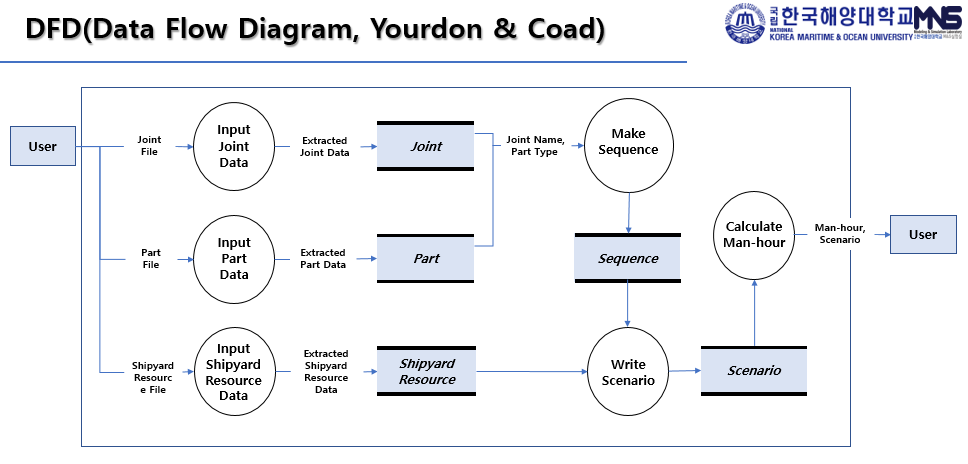

@page subsystem1 Diagram
@subpage subsubsystem1
@tableofcontents

이번 장에서는 SSA 프로젝트가 어떤 흐름으로 구동되는지에 대해 서술합니다. 

아래 다이어그램에서 SSA 프로그램이 실행 과정을 확인할 수 있습니다.

@section Simulator

Simulator는 전체 시뮬레이션을 통합 관리하는 클래스입니다.

@section Builder

Builder는 시뮬레이션에 동적 생성에 필요한 게임 오브젝트(미사일, 함정, 디코이)를 생성하는데 필요한 클래스입니다.

@section Missile

미사일의 구성에 대 해서 서술

@subsection MissileCIWS

미사일의 CIWS에 대해서 서술
