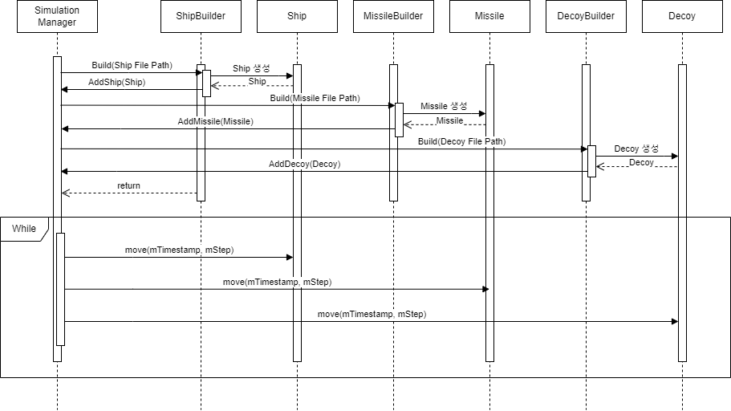

@page subsystem1 Diagram
@tableofcontents

이번 장에서는 SSA 프로젝트가 어떤 흐름으로 구동되는지에 대해 서술합니다. 

Sequence Diagram은 특정 행동을 할 때 시작점에서부터 관련된 인스턴스의 데이터 주고받기, 함수 호출 등을 그림으로 한 눈에 보여주는 다이어그램입니다.

@section SimulatorManager

SimulationManager 클래스는 전체 시뮬레이션을 통합 관리하는 클래스입니다.

@section Builder

ShipBuilder, MissileBuilder, DecoyBuilder 클래스는 시뮬레이션에 동적 생성에 필요한 게임 오브젝트(미사일, 함정, 디코이)를 생성하는 클래스입니다.

@section Ship

Timestamp별 선박의 위치값을 가지고 있는 객체입니다.

Update 함수가 반복될 때마다 위치값이 업데이트됩니다.

@section Missile

Timestamp별 선박의 위치값을 가지고 있는 객체입니다.

Update 함수가 반복될 때마다 위치값이 업데이트됩니다.

@section Decoy

Timestamp별 디코이의 위치값을 가지고 있는 객체입니다.

Update 함수가 반복될 때마다 위치값이 업데이트됩니다.
